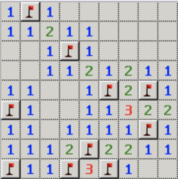

# Minesweeper Challenge

- Build a web based minesweeper game in 5 hours using your choice of technologies.
- Ensure the game will run 100% in browser and does not require any backend code. All state needs to be in the browser (think in-memory or localStorage)
- You should focus on making minesweeper functional and let the player control the size of the board and number of mines added
- Extra credit make it look amazing, add sounds, show off your HTML wizardry 
- Recommend you use jquery or raw HTML5/DOM. 

<strong>NOTE</strong>: You can use google to lookup framework references like jquery, react, etc. 

## Rules
- Game goal is to find/mark all mines
- When a square is clicked reveal if its a mine or reveal all bordering squares with the number adjacent mines
- When a square not bordering a mine is clicked reveal all bordering empty and bordering mine squares
- Let users mark squares they think have a mine

## Running
- npm install
- npm start
- view at http://localhost:8080/

All game code can be found in the public directory. i.e. `game.js` `game.html` `game.css`